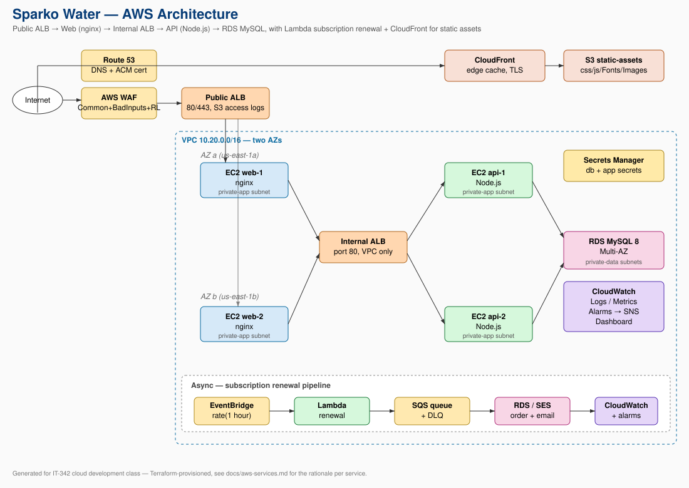

# Sparko Water — Subscription E-Commerce on AWS

A full-stack water subscription / e-commerce platform deployed on AWS.
Built for IT-342 (cloud development).



## What's here

```
.
├── Back-End/       Node.js + Express API. Auth, products, cart, reviews,
│                   rewards, Square checkout. Reads secrets from AWS Secrets
│                   Manager, ships JSON logs to CloudWatch, sends mail via SES.
├── Front-End/      Vanilla-JS multi-page UI. Shopping cart, product search,
│                   reviews, rewards page, Square Web Payments SDK.
├── Database/       MySQL schema + seed + migrations.
├── lambda/         Subscription-renewal Lambda (EventBridge schedule +
│                   SQS-driven consumer in one function).
├── setup/          Idempotent bash setup scripts for each tier — invoked
│                   by EC2 user-data when a new instance boots.
├── .github/        CI workflows: app deploy via OIDC, syntax checks.
└── docs/           Architecture, AWS-services rationale, cost estimate,
                    security model, runbook.
```

## AWS services used

VPC · EC2 + Auto Scaling Groups · Application Load Balancer (×2) · RDS MySQL
· Lambda · EventBridge · SQS · SNS · Secrets Manager · CloudFront · S3 ·
ACM · Route 53 · CloudWatch (Logs / Metrics / Alarms / Dashboard) · AWS WAF
· SES · IAM · KMS · Systems Manager (Session Manager) · GitHub OIDC.

See [`docs/aws-services.md`](docs/aws-services.md) for what each service does
and why we chose it.

## Quickstart

The AWS resources were created by hand in the console + CLI. To stand up a
new copy:

1. Build a VPC with public + private-app + private-data subnets across two AZs.
2. Provision an RDS MySQL 8 instance in the private-data subnets.
3. Create two ALBs (public-facing for nginx, internal for the API), each
   with a target group + health check.
4. Create two Auto Scaling Groups (web + API) with Launch Templates whose
   user-data clones this repo and runs the matching script from `setup/`.
5. Create the SQS queue + DLQ + EventBridge rule + Lambda function from
   `lambda/subscription-renewal/`.
6. Wire CloudWatch alarms → SNS topic, and subscribe an operator email.
7. Seed the database via Session Manager (see `docs/runbook.md`).
8. Hit the ALB DNS in a browser.

The full layered breakdown is in [`docs/architecture.md`](docs/architecture.md).

## Application features

- **Auth**: register, login, password reset (with SES emails), JWT, RBAC
  (`user`, `admin`).
- **Catalog**: products with search, filter, sort; admin CRUD.
- **Reviews**: 1 review per (user, product) with star ratings, average,
  distribution, admin moderation. Posting earns 25 reward points.
- **Cart**: persistent per-user cart with auto-applied bundle discounts.
- **Bundle rewards**: "buy N items, save X%" promos managed by admins.
- **Rewards points**: 10 pts / $1 spent, 100 pts = $1 redeem value, tier
  ladder (bronze→silver→gold→platinum).
- **Checkout**: Square Web Payments SDK on the frontend; backend creates
  the order, charges the saved card, awards points, redeems requested
  points, and emails a receipt — all transactionally.
- **Subscriptions**: weekly / biweekly / monthly delivery. Renewal Lambda
  runs hourly, creates orders from due subscriptions, advances
  `next_delivery`, awards points, and emails the customer. Failed renewals
  retry up to 3 times then page an operator.
- **Admin dashboard**: stats, user / role / product / order management.

## Cloud-native patterns demonstrated

| Pattern | Where it shows up |
|---|---|
| Multi-AZ redundancy | ASGs span 2 AZs; RDS Multi-AZ; NAT-GW (optionally one per AZ) |
| Health-aware load balancing | ALB target groups use `/nginx-health` and `/readyz`; nginx upstream has `max_fails` + `proxy_next_upstream` |
| Graceful shutdown | API listens for SIGTERM and drains in-flight requests before exiting (ALB deregistration friendly) |
| Rolling deploys | ASG `instance_refresh` with `min_healthy=90%` and `instance_warmup` |
| Auto-scaling | Target-tracking on average CPU (60%) for both web and API ASGs |
| Least-privilege IAM | Inline policies scoped to specific secret ARNs, log groups, and a `ses:FromAddress` condition |
| Keyless CI | GitHub OIDC → IAM role assumed by Actions — no static AWS keys in the repo |
| Secrets at rest | DB password + JWT + Square keys in Secrets Manager; EC2 reads at boot, Lambda reads on cold start |
| Network isolation | VPC with public / private-app / private-data subnets; SG chain `internet → alb → web → alb_internal → api → db` |
| Event-driven async | EventBridge → Lambda → SQS → Lambda (same function in 2 modes) → RDS + SES, with DLQ + alarm |
| Observability | Structured JSON logging with `requestId` propagation; CloudWatch dashboard + alarms wired to SNS |
| Edge caching | CloudFront in front of an S3 origin with Origin Access Control |
| Edge security | WAF v2 managed rule groups + per-IP rate-based rule |
| Encryption everywhere | EBS, RDS storage, S3, ACM/TLS in transit |

## Documentation index

| Doc | What's in it |
|---|---|
| [docs/architecture.md](docs/architecture.md) | Layer-by-layer breakdown of the stack |
| [docs/architecture.svg](docs/architecture.svg) | Visual diagram |
| [docs/aws-services.md](docs/aws-services.md) | Every AWS service used + why |
| [docs/cost-estimate.md](docs/cost-estimate.md) | Monthly cost breakdown at demo and 10× sizes |
| [docs/security.md](docs/security.md) | IAM, network, application security model |
| [docs/runbook.md](docs/runbook.md) | "Alarm fired — now what?" playbook |
| [setup/README.md](setup/README.md) | EC2 bootstrap scripts (invoked by user-data) |

## Repository conventions

- **No long-lived AWS credentials** in the repo. CI uses OIDC.
- **No secrets in `.env`**. `.env.example` documents the shape; production
  pulls from Secrets Manager.
- **Idempotent setup scripts** so they can be re-run safely.
- **Tagged everything**: `Project`, `Environment`, `Owner` applied at
  resource creation time so cost-allocation reports group cleanly.

## Local development

```bash
# Database
mysql < Database/schema.sql
mysql < Database/seed.sql

# Backend
cd Back-End
cp .env.example .env   # fill in DB creds + a JWT secret
npm install
npm run dev            # nodemon on :3000

# Frontend — just open Back-End's static-served files via the API:
open http://localhost:3000/index.html
```

In local mode the secrets loader and SES helper are no-ops; the API still
runs.

## License

For class use.
